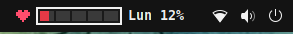
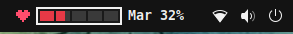
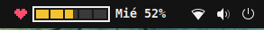
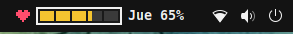
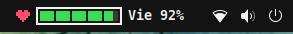
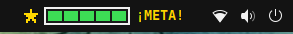

# Week HP

A retro 2D platformer health bar for the GNOME Shell top panel that fills up
as your work week goes by. Reach Friday and… **GOAL!** ⭐

## How it works

The bar has five segments, one for each day from Monday to Friday.
The current day fills up little by little during working hours, and the color
changes as you make progress, just like a health bar in a video game.

| Day | Top panel |
|---|---|
| Monday |  |
| Tuesday |  |
| Wednesday |  |
| Thursday |  |
| Friday |  |
| Friday 13:00 until Sunday |  |

- Days progress from **9:00 to 18:00**. Friday is a short day and ends at **13:00**.
- **Red** below 40%, **yellow** below 80%, **green** after that.
- When Friday's workday ends, the heart turns into a star and the weekly goal is complete.
  The bar stays full over the weekend and starts again on Monday.

The screenshots are in Spanish: Week HP follows your system language and
speaks **English, Spanish and French**.

## Installation

Requires GNOME Shell 50.

```bash
git clone https://github.com/asterion/week-hp.git \
    ~/.local/share/gnome-shell/extensions/week-hp@asterion
```

Log out and back in, then enable it:

```bash
gnome-extensions enable week-hp@asterion
```

## Customize your hours

Working hours are set at the top of [`weekProgress.js`](weekProgress.js):
`DAY_START_HOUR`, `DAY_END_HOUR` and `FRIDAY_END_HOUR`.

## Contributing

Translations and bug reports are welcome! Please follow our
[Code of Conduct](CODE_OF_CONDUCT.md).

## License

[GPL-2.0-or-later](LICENSE)
